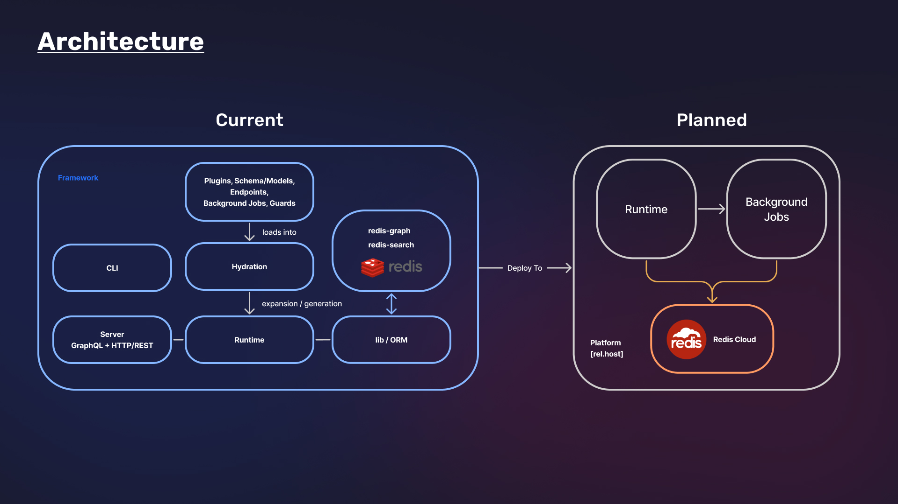

# rel - The backend-in-a-box for Javascripters

There has been quite the renaissance in the Javascript world over the past 10 years. New frontend tooling is pushing the boundaries of both native and web applications.

Our goal is to apply some of the foundations that have made frontend tooling successful to the backend. We want to have you up and running in minutes

# Documentation

Visit [https://rel.run](https://rel.run) to view the full documentation.

# Quickstart

Run `npx create-rel-app` to initialize a new project.

This will run your though a few questions about your project and generate a runnable server.

Once finished, you will have the following project structure:

```
./myapp
│
├── auth
│   └── auth.ts
├── jobs
│   └── ...
├── schema
│   └── ...
├── server.ts
├── package.json
├── relconfig.json
├── tsconfig.json
└── Dockerfile
```

Add new models by running `rel model Book`

```
// ./models/Book.ts

import { model, string } from "@reldb/meta"

export default model().fields({
  name: string().required(),
  // ... add other fields
})
```

If you want to define Authentication models, change ports, etc, find in `./server.ts`

```
import { server, loadSchema } from "@reldb/run"
import { Social, Methods } from "@reldb/auth"

const port = process.env.PORT

export default server({
  auth: Social({
    providers: {
      email: Mailgun({
        apiKey: "..."
      })
    },
    methods: [
      Methods.EmailPassword(),
      Methods.EmailLink(),
    ],
  }),
  port
})
```

Then run your project:

```
rel dev
```

<!-- See all configuration options here: https://rel.run/docs/config -->

# Examples

We have written a number of example projects like Clubhouse, Instagram, Shopify, to show you how easy it is to get setup with rel.

Visit [https://rel.run/examples](https://rel.run/examples)

# What is rel?

rel is a batteries-included, highly configurable and extensible backend-as-a-service for generating GraphQL, REST, and metal APIs. rel is written in [Typescript](https://www.typescriptlang.org/) and [Cypher](http://www.opencypher.org/) on [redis-graph](http://www.opencypher.org/).

rel is designed to handle the 80%+ usecase for most applications. Out of the box it comes with a ton of configurable modules:

- Customizable domain model (e.g. Users _HAVE_ Followers, Users \_BELONG_TO Accounts)
- Authentication models (social, saas, crypto, forum, etc.)
- A privileges + guard system with controls at the model, field and endpoint level.
- Background jobs
- Plugin support for Images (via Imgix), Video (via Mux), Files (via S3, gCloud storage, etc)
- Endpoints generated in your flavor of choise (REST, GraphQL)

The name rel is an homage to CYPHER relationship, the rel.

## What is CYPHER?

Quite simply, CYPHER is SQL for Graph Databases, but infinitely better. It's a far more elegant and visually representative query language. We're big fans.

Whereas a SQL database seeks to force data into a specific format via field and table constraints, a Graph DB seeks to "make sense" of your data by allowing you to look at it in different ways. We like to think of it as providing the 10,000 ft view all the way down to the

You can read more on Why CYPHER on our documentation: [https://rel.run/docs/why-cypher](https://rel.run/docs/why-cypher)

In general, using rel you will likely never have to write Cypher since the persistence layer is handled for you. However, there are advanced settings that let you drop into a CYPHER query from any endpoint or field.

## Architecture



# Contributing

We are actively looking for backend and graph developers to help make rel a success.

Please see our contributing.md.
